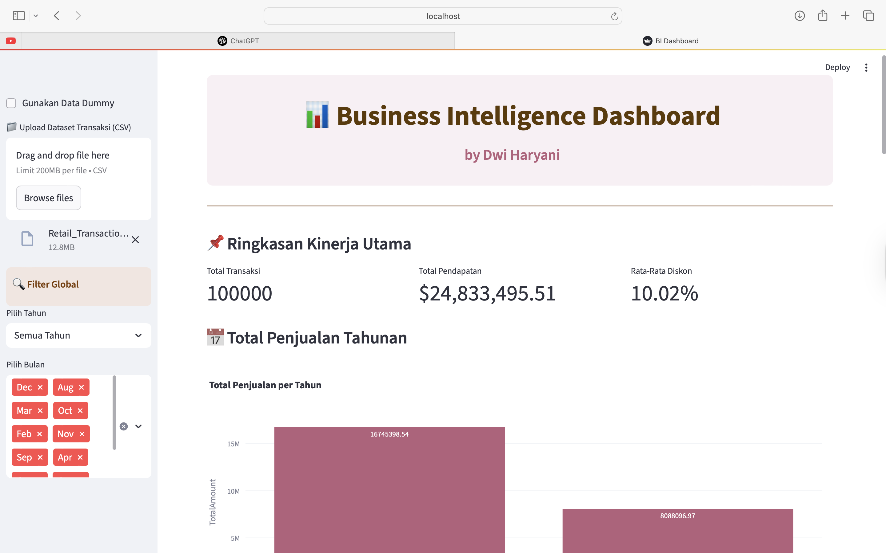

# 📊 Business Intelligence Dashboard

**Business Intelligence Dashboard Interaktif** untuk analisis data penjualan berdasarkan lokasi toko, kategori produk, metode pembayaran, dan tren bulanan.  
Dibuat menggunakan **Streamlit**, **Pandas**, dan **Plotly** oleh **Dwi Haryani**.

---


---

## 🖼️ Cuplikan Dashboard

)

---

## 📂 Dataset

📌 Dataset tersedia di dalam repositori ini: [`Retail_Transaction_Dataset.csv`]

Struktur kolom:
- `CustomerID`
- `ProductID`
- `Quantity`
- `Price`
- `TransactionDate`
- `PaymentMethod`
- `StoreLocation`
- `ProductCategory`
- `DiscountApplied(%)`
- `TotalAmount`

---

## ✨ Fitur Utama

- 📅 Filter interaktif: **Tahun** & **Bulan**
- 🛍️ **Top 5 Kategori Produk Terlaris**
- 🏪 **Pendapatan per Lokasi Toko (Top 10)**
- 🏆 **Top Produk Terjual**
- 💳 Visualisasi **Metode Pembayaran**
- 📈 **Tren Penjualan Bulanan**
- 📊 Semua visualisasi disajikan dalam format interaktif dengan **Plotly**
- 📥 Bisa digunakan dengan dataset asli atau data dummy

---

## ⚙️ Spesifikasi Aplikasi

| Komponen        | Teknologi            |
|----------------|----------------------|
| Bahasa         | Python 3.8+          |
| Framework UI   | Streamlit            |
| Visualisasi    | Plotly Express       |
| Manipulasi Data| Pandas               |
| Tampilan       | Responsive & Clean UI|

---

## 🛠️ Cara Menjalankan di Lokal

1. **Clone repositori** ini:
```bash
git clone https://github.com/USERNAME/bi-dashboard-streamlit.git
cd bi-dashboard-streamlit
